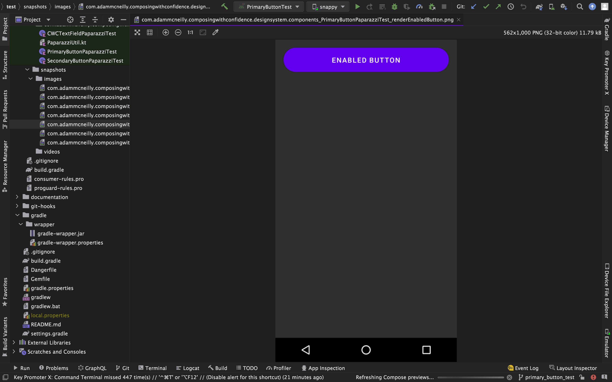

slidenumbers: true
autoscale: true
footer: @AdamMc331<br/>#DCNYC22
build-lists: true

# Composing With Confidence
## Adam McNeilly - @AdamMc331

---

# Testing Is Important

---

# With New Tools Comes New Responsibilities

---

# Getting Started With Compose Testing[^1]

[^1]: https://goo.gle/compose-testing

---

# Two Options For Compose Testing

* Individual components
* Activities

---

# Compose Rule Setup

```kotlin
class PrimaryButtonTest {

	// When testing individual components, we can just create a compose rule.
	@get:Rule
	val composeTestRule = createComposeRule()
}
```

---

# Compose Rule Setup

[.code-highlight: 7-9]
```kotlin
class PrimaryButtonTest {

	// When testing individual components, we can just create a compose rule.
	@get:Rule
	val composeTestRule = createComposeRule()

	// When testing activities, use androidComposeRule.
	@get:Rule
	val composeTestRule = createAndroidComposeRule<MainActivity>()
}
```

---

# Rendering Content

```kotlin
class PrimaryButtonTest {

	// ...

	@Test
	fun renderEnabledButton() {
		composeTestRule.setContent {
			PrimaryButton(
				text = "Test Button",
				enabled = true,
			)
		}
	}
}
```

---

# Test Recipe

[.code-highlight: 1-2]
[.code-highlight: 4-6]
[.code-highlight: 8-10]
```kotlin
// Find component
composeTestRule.onNodeWithText("Test Button")

// Make assertion
composeTestRule.onNodeWithText("Test Button")
	.assertIsEnabled()

// Perform action
composeTestRule.onNodeWithText("Test Button")
	.performClick()
```

---

# Finding Components

---

# Finding Components

```kotlin
composeTestRule.onNode(matcher)

composeTestRule.onNode(hasProgressBarRangeInfo(...))
composeTestRule.onNode(isDialog())
```

---

# Finding Components

[.code-highlight: 6-9]
```kotlin
composeTestRule.onNode(matcher)

composeTestRule.onNode(hasProgressBarRangeInfo(...))
composeTestRule.onNode(isDialog())

// Helpers
composeTestRule.onNodeWithText("")
composeTestRule.onNodeWithTag("")
composeTestRule.onNodeWithContentDescription("")
```

---

# Finding Components

```kotlin
composeTestRule.onAllNodes(matcher)

composeTestRule.onAllNodesWithText("")
```

---

# Making Assertions

---

# Making Assertions

```kotlin
composeTestRule
	.onNode(...)
	.assert(matcher)

composeTestRule
	.onNode(...)
	.assert(hasText("Test Button"))

composeTestRule
	.onNode(...)
	.assert(isEnabled())
```

---

# Making Assertions

```kotlin
composeTestRule
	.onNode(...)
	.assert(hasText("Test Button"))

// Helpers
composeTestRule
	.onNode(...)
	.assertTextEquals("Test Button")
```

---

# Performing Actions

---

# Performing Actions

```kotlin
composeTestRule
	.onNode(...)
	.performClick()

composeTestRule
	.onNode(...)
	.performTextInput(...)
```

---

# Cheat Sheet[^2]


[^2]: https://developer.android.com/static/images/jetpack/compose/compose-testing-cheatsheet.png

---

# Test Tags

---

# Test Tags

```kotlin
// In app
PrimaryButton(
	modifier = Modifier.testTag("login_button")
)

// In test
composeTestRule.onNodeWithTag("login_button")
```

---

# Let's Test A Component

---

# Primary Button

[.code-highlight: all]
[.code-highlight: 5]
```kotlin
@Composable
fun PrimaryButton(
    text: String,
    onClick: () -> Unit,
    enabled: Boolean = true,
)
```

---

# Setup

```kotlin
@RunWith(AndroidJUnit4::class)
class PrimaryButtonTest {

    @get:Rule
    val composeTestRule = createComposeRule()

    @Test
    fun handleClickWhenEnabled() {
        // ...
    }
}
```

---

# Render Content

```kotlin
var wasClicked = false

composeTestRule.setContent {
    PrimaryButton(
        text = "Test Button",
        onClick = {
            wasClicked = true
        },
        enabled = true,
    )
}
```

---

# Verify Behavior

```kotlin
composeTestRule
    .onNodeWithText("Test Button")
    .performClick()

assertTrue(wasClicked)
```

---

# Let's Write A Bigger Test

---


---

# Setup

```kotlin
@RunWith(AndroidJUnit4::class)
class MainActivityTest {

    @get:Rule
    val composeTestRule = createAndroidComposeRule<MainActivity>()

    @Test
    fun successfulLogin() {
        // ...
    }
}
```

---

# Verify Login Button Disabled

```kotlin
composeTestRule
    .onNodeWithTag("login_button")
    .assertIsNotEnabled()
```

---

# Type Username

```kotlin
composeTestRule
    .onNodeWithTag("username_text_field")
    .performTextInput("adammc331")
```

---

# Type Password

```kotlin
composeTestRule
    .onNodeWithTag("password_text_field")
    .performTextInput("Hunter2")
```

---

# Verify Login Button Enabled

```kotlin
composeTestRule
    .onNodeWithTag("login_button")
    .assertIsEnabled()
```

---

# Click Login Button

```kotlin
composeTestRule
    .onNodeWithTag("login_button")
    .performClick()
```

---

# Verify Home Screen Displayed

```kotlin
composeTestRule
    .onNodeWithTag("home_screen_label")
    .assertIsDisplayed()
```

---

# Full Test

```kotlin
@Test
fun successfulLogin() {
    composeTestRule
        .onNodeWithTag("login_button")
        .assertIsNotEnabled()

    composeTestRule
        .onNodeWithTag("username_text_field")
        .performTextInput("adammc331")

    composeTestRule
        .onNodeWithTag("login_button")
        .assertIsNotEnabled()

    composeTestRule
        .onNodeWithTag("password_text_field")
        .performTextInput("Hunter2")

    composeTestRule
        .onNodeWithTag("login_button")
        .assertIsEnabled()

    composeTestRule
        .onNodeWithTag("login_button")
        .performClick()

    composeTestRule
        .onNodeWithTag("home_screen_label")
        .assertIsDisplayed()
}
```

---

# Test Robots

---

# LoginScreenRobot

```kotlin
class LoginScreenRobot(
    composeTestRule: ComposeTestRule,
) {
    private val usernameInput = composeTestRule.onNodeWithTag("username_text_field")
    private val passwordInput = composeTestRule.onNodeWithTag("password_text_field")
    private val loginButton = composeTestRule.onNodeWithTag("login_button")
}
```

---

# LoginScreenRobot

```kotlin
class LoginScreenRobot {
    // ...

    fun enterUsername(username: String) {
        usernameInput.performTextInput(username)
    }

    fun enterPassword(password: String) {
        passwordInput.performTextInput(password)
    }
```

---

# Kotlin Magic

```kotlin
fun loginScreenRobot(
    composeTestRule: ComposeTestRule,
    block: LoginScreenRobot.() -> Unit,
) {
    LoginScreenRobot(composeTestRule).apply(block)
}
```

---

# Kotlin Magic

```kotlin
loginScreenRobot(composeTestRule) {
    verifyLoginButtonDisabled()
    enterUsername("adammc331")
    enterPassword("Hunter2")
    verifyLoginButtonEnabled()
    clickLoginButton()
}
```

---

# Kotlin Magic

```kotlin
@Test
fun successfulLogin() {
    loginScreenRobot(composeTestRule) {
        verifyLoginButtonDisabled()
        enterUsername("adammc331")
        enterPassword("Hunter2")
        verifyLoginButtonEnabled()
        clickLoginButton()
    }

    homeScreenRobot(composeTestRule) {
        verifyLabelDisplayed()
    }
}
```

---

# Other Testing Options

---

# Shot


---

# Paparazzi


---



---

# One More Repo...

---

# Composing With Confidence Sample Project


---

